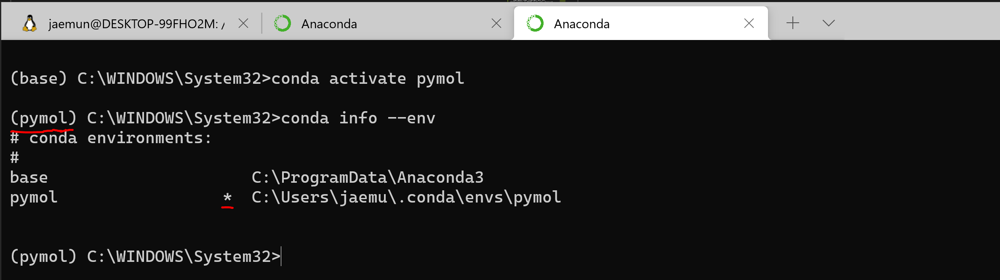
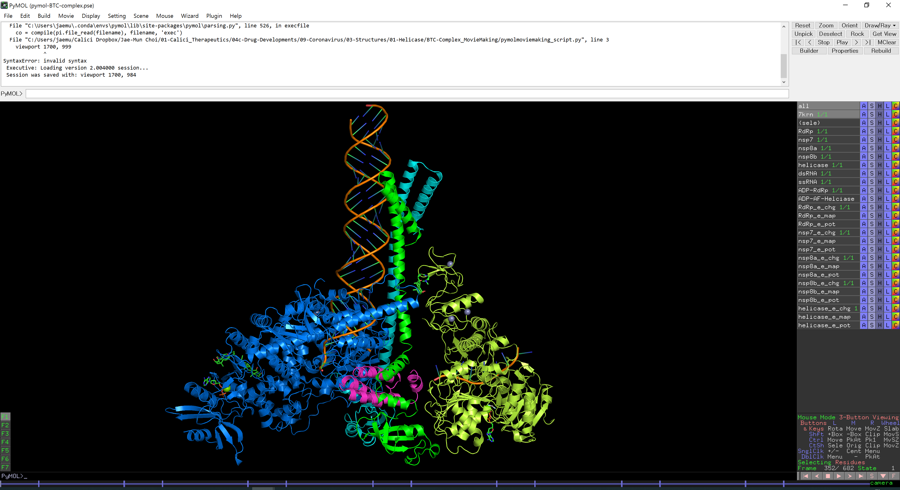
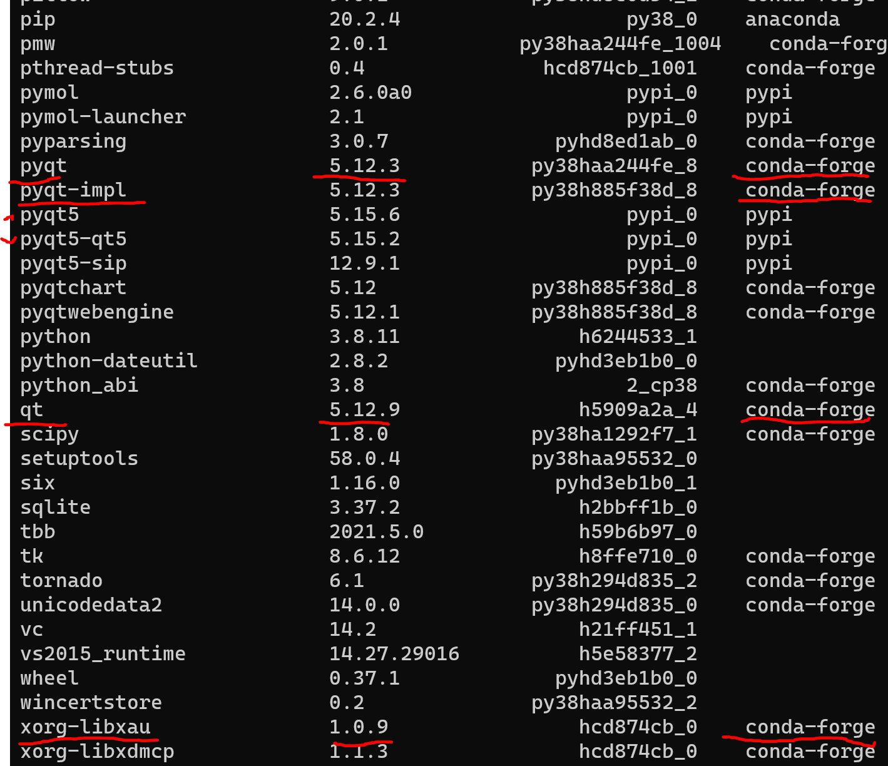

# 0. What is Pymol
Pymol is structural biology tool for viewing and editing protein structure.  
파이몰은 있자너 단백질 구조를 시각적으로 볼수 있게 해주거던 그냥 설치하면돼.   
There are similar kinda called Chimera, VMD, PMV... somany of them but Pymol has the most intuitive interface and selection mechanism.   
머 잡다한것들 여러개가 있지만 파이몰은 좀 직관적이라 사용하기 편할거야 ...

# 1. Installation Methods
History goes back to 2000. guy name called Warren Lyford DeLano wrote the first code as a open source. Then 2010 Schrödinger, Inc. purchased it. 간단히 말해 슈레딩거가 오픈소스였던 파이몰을 산거야.
So Schrödinger offers 1) Msi file to install on Windows 10 and it is not free. 윈도우 설치파일은 돈내야함 2) Pip install. 핍이 파이썬 패케이지 매니져란걸 다들 알지? 근데 말이야 핍이 처음 나왔을때 파이썬 라이브러리 위주였기때문에 그때는 Numpy같은 C언어로된 넘들을 컴파일 해야하면 잘 안되고 그랬거던... 머 지금은 잘되긴해 하지만 생물정보학 전공자라면 많은 수의 패케이지가 없어... 불편할거야. 3) Conda install. 아나콘다 패케이지 매니져는 굉장히 커서 다양한 생물정보학 툴들을 포함하고있고 콘다 환경안에 pip을 포함 할 수 있기 때문에 더 많은걸 하려면 이걸 권장해. 최대한 콘다로 설치하고 안되는것들은 pip을 이요해 설치한다면 둘이 충돌을 일으키는걸 막을 수 있을꺼야.

# 2. Using Anaconda install Pymol
We will use conda install because we need a lot more for the updated modules.   
우리는 있지 콘다를 써서 설치해볼꺼야. 그게 속편하거든 형을 믿어라 ^^ 알쥐.  
https://omicx.cc/posts/2021-04-20-install-pymol-windows/  
위 링크에 보면 설명이 있고 이걸 참고하면되는데 바뀐점은 Anacoda를 사용할 거고 윈도우 터미널을 사용한다는 가정을 할거야.

## 1) Locate the source code
https://github.com/schrodinger/pymol-open-source  
Here is the souce code, however it is mix of C++, Python, Numpy, Tkinter, PyQT.   
오픈소스가 다 그러하듯 코드가 역사도 오래되고 개발자가 바뀌면서 일관성이 없어 ... 쓰레기까진아니지만 컴파일이 잘 안될 수도 있거던.....
So here is the binary file  
https://www.lfd.uci.edu/~gohlke/pythonlibs/#pymol-open-source  
Thanks to  Christoph Gohlke of the Laboratory for Fluorescence Dynamics, University of California, Irvine, he has lots of pre-compiled binaries of whl files.   
고맙게도 크리스토퍼가 컴파일 다 해놨으니까 님들은 그냥 다운로드만 받으면됨.  

  

파이썬 버젼과 윈도우가 32비트인지 64비트인지 잘 알아보고 다운로드하시길 바람. 다양한 켐비네이션이 존재하지만 파이몰 버젼 2.4와 파이썬 버젼 3.8이 잘 구동되는것을 확인했슴 참고바람. 

## 2) Install Anaconda
Well This is a time sensitive issue. so far at the year of 2022 march. There are Python version 3.10 got released. and official support for Anaconda is 3.9 then should I download conda version 3.8? NO. Just download latest version then we will create downgraded python environment.  
 아나콘다를 줄여서 콘다라고하는데 좀더 가벼운 최소사향을 미니콘다라고 하는것을 다들 알죠 ^^. 콘다 설치는 콘다 홈피에 가면 너무 쉽게 설명이되어있어서 내 윈도우 활경을 찾아서 설치파일을 안내해줌 꿀.... 전에는 내가 설치한 파이썬 버젼에 맞추어서 파이썬으로 설치해야했슴... 흑 역사 ^^; 단 콘다에서는 파이썬 버젼을 강제하는데 파이썬이 3.10까지 나온 상황이고 최신걸 받으면 파이썬 버젼 3.9일건데 문제는 아직은 불안정하기때문에 그냥 최신 콘다를 다운로드 받고 파이몰을 위한 환경에서 파이썬버젼을 3.8로 다운그레이드 시킬꺼임 ^^  

   
C:\ProgramData\Anaconda3  
에 설치가됨을 알 수 있죠 ^^  
 
 

## 3) Create pymol environment
윈도우 cmd에서 다음 명령어를 처보자. 콘다가 제대로 설치되어 있다면 버추얼 환경이 만들어져해. 근데 아직도 cmd나 혹은 Powershell 혹은 gitbash를 Windows10에서 사용하고 있는 친구들이 있다면 당장 Windows Terminal로 갈아타라고 추천해주고 싶어.  

https://docs.microsoft.com/ko-kr/windows/terminal/install  

왜냐하면 나중에 이 Windows Terminal 설정하는것도 다룰거거든 ^^ 하여간 VS code와 Windows Terminal은 필수 임을 명심하쟈.

    conda create -n pymol  python=3.8

This commad will create conda environment with python version 3.8.   
파이썬 2.7 분리한다고들 할때부터 이런 사단이 날걸 예상했지만 파이썬 버젼이 업글될때마다 오래된 프로그램들은 새버젼 파이썬에서 안돌아감 발암 ^^; 그럼에도 불구하고 맨날 Backward compatibility 만 주구장장 선전함 ^^; 그래서 생겨난것들이 venv, Pyvenv, pipenv 주구 장장 많치만 버추얼 환경을 구성하는데 콘다 만큼 확실한게 없슴. 요즘 뜬다고하는 Poetry는 시간 있는 사람함 해보고 횽아 한테 알려주기바래.  

    conda activate pymol

  

가상환경이 2개였다가 바뀌는걸 확인 할 수있고 현재 가상환경이 pymol임을 친절히 알려주네 ^^  

    conda install -c conda-forge pip numpy pmw biopython    
    conda config --add channels salilab
    conda install modeller
    conda list

conda list will display all the packages installed so far. You have to have a modeller key by asking salilab page.  
콘다 리스를 통하여 최종적으로 설치된 패케이지들을 확인해볼 수 있슴. 모델러 같은 경우에는 라이센스키가 필요하니 살리 연구실 홈피에가서 요청하삼.

## 4) Install Pymol whl files
switch dirive by typing it is not cd d: unlike Linux system  

    d:

and navigate to find pymol two whl files, and install both by pip   

    pip install --no-index --find-links="%CD%" pymol_launcher-2.1-cp38-cp38-win_amd64.whl
    pip install --upgrade --no-deps pymol-2.4.0-cp38-cp38-win_amd64.whl  

to update existing pymol then 

    pip install --upgrade --no-deps pymol-2.4.0-cp38-cp38-win_amd64.whl  

then pymol installation is completed.

## 5) Launch Pymol
To start Pymol on Windows terminal command give  

    pymol

simple yeah ^^ make sure You activated pymol conda environment.   

They changed GUI from tkinter to QT so we had to install PyQT5 for plugin install.  
 
 

# 3. for Advanced Users (Intall Plugins and Terminal setup)
Pymol provides lots of plugins or even you can develop a plugin by yourselves using PyQt.

## 1) Warning about pyqt vs pyqt5 conflit
Pymol's default GUI was tkinter untill version 2.1. they introduced QT options. Some of the plugins you will see on the internet start to use pyqt5. but in conda there is no pyqt5 so it is easy to install pyqt and install dependency qt and xorg library then later on install pyqt5 using pip command. Then thing will be messy like this.   

it is hard to grasp what is happening. and conda uninstall pyqt5 will not work because it has to be pip uninstall pyqt5.  
초기 파이몰이 GUI를 제공하기위해 tkinter를 사용했지만 버젼 2.1부터 pyqt5를 지원하기 시작했슴. 근데 conda-forge 레포에는 pyqt5가 없으니 pyqt를 대신 설치하고 나중에 pip으로 pyqt5를 설치하게되면 그림처럼 레포가 서로다는게 설치되게되고 심지어 xorg(리눅스)에나 있을법한것들이 설치되게됨. 파이몰 레포를 보게되면 pypi인걸 알 수 있고 이건 conda 하위 pip을 설치된거거든 따라서 pyqt를 uninstall해주어야함. 

    # Name                    Version                   Build  Channel
    biopython                 1.79             py38h294d835_1    conda-forge
    ca-certificates           2022.2.1             haa95532_0
    certifi                   2021.10.8        py38haa95532_2
    git                       2.34.1               haa95532_0
    intel-openmp              2022.0.0          haa95532_3663
    libblas                   3.9.0              13_win64_mkl    conda-forge
    libcblas                  3.9.0              13_win64_mkl    conda-forge
    liblapack                 3.9.0              13_win64_mkl    conda-forge
    m2w64-gcc-libgfortran     5.3.0                         6    conda-forge
    m2w64-gcc-libs            5.3.0                         7    conda-forge
    m2w64-gcc-libs-core       5.3.0                         7    conda-forge
    m2w64-gmp                 6.1.0                         2    conda-forge
    m2w64-libwinpthread-git   5.0.0.4634.697f757               2    conda-forge
    mkl                       2022.0.0           h0e2418a_796    conda-forge
    modeller                  10.2             py38he774522_1    salilab
    msys2-conda-epoch         20160418                      1    conda-forge
    numpy                     1.19.0+mkl               pypi_0    pypi
    openssl                   1.1.1m               h2bbff1b_0
    pip                       20.2.4                   py38_0    anaconda
    pmw                       2.0.1           py38haa244fe_1004    conda-forge
    pymol                     2.6.0a0                  pypi_0    pypi
    pymol-launcher            2.1                      pypi_0    pypi
    python                    3.8.11               h6244533_1
    python_abi                3.8                      2_cp38    conda-forge
    scipy                     1.8.0            py38ha1292f7_1    conda-forge
    setuptools                58.0.4           py38haa95532_0
    sqlite                    3.37.2               h2bbff1b_0
    tbb                       2021.5.0             h59b6b97_0
    vc                        14.2                 h21ff451_1
    vs2015_runtime            14.27.29016          h5e58377_2
    wheel                     0.37.1             pyhd3eb1b0_0
    wincertstore              0.2              py38haa95532_2

even with this minimal packages, pymol runs without problem. but we can't use Pymod3 plugin so we need to install pyqt5 anyway. 

    (pymol) C:\WINDOWS\system32>pip install pyqt5
    Collecting pyqt5
    Using cached PyQt5-5.15.6-cp36-abi3-win_amd64.whl (6.7 MB)
    Collecting PyQt5-sip<13,>=12.8
    Using cached PyQt5_sip-12.9.1-cp38-cp38-win_amd64.whl (77 kB)
    Collecting PyQt5-Qt5>=5.15.2
    Using cached PyQt5_Qt5-5.15.2-py3-none-win_amd64.whl (50.1 MB)
    Installing collected packages: PyQt5-sip, PyQt5-Qt5, pyqt5
    Successfully installed PyQt5-Qt5-5.15.2 PyQt5-sip-12.9.1 pyqt5-5.15.6
  
## 3) Install Pymol extended scripts (Depreciated)
wxpython doen't support Python 3.8 so we need to convert wxpython part to PyQT5  

----------------------- Skip this part  Start --------------  

There were so many interface changes so we need to install many dependencies.  

    conda install -c conda-forge scipy matplotlib wxpython git
    cd C:\Users\jaemu\.conda\envs\pymol\Lib\site-packages\pymol\pymol_path
    git clone https://github.com/Pymol-Scripts/Pymol-script-repo

* keep in mind that Pymol installation directory might change depending on which Anaconda or miniconda package installed so try to get the installation directory in the "Pymol cmd" 

    print os.environ['PYMOL_PATH']

create and edit file suing VS code.
   
Then creat a file "run_on_startup.py" under the directory of C:\Users\jaemu\.conda\envs\pymol\Lib\site-packages\pymol\pymol_path  
ad code will be like this  

     # Add paths to sys.path so PyMOL can find modules and scripts
    import sys, os
    pymol_git = os.path.abspath(os.path.join(os.environ['PYMOL_PATH'], 'Pymol-script-repo'))
    os.environ['PYMOL_GIT_MOD'] = os.path.join(pymol_git,'modules')
    sys.path.append(pymol_git)
    sys.path.append(os.environ['PYMOL_GIT_MOD'])

    # Make setting changes to Plugin Manager
    import pymol.plugins
    pymol.plugins.preferences = {'instantsave': False, 'verbose': False}
    pymol.plugins.autoload = {'apbs_tools': False}
    pymol.plugins.set_startup_path([os.path.join(pymol_git, 'plugins'), os.path.join(sys.prefix, 'Lib', 'site-packages', 'pmg_tk', 'startup')])
    pymol.plugins.preferences = {'instantsave': True, 'verbose': False}  

--------------------------- Skip this part end --------------------------------

