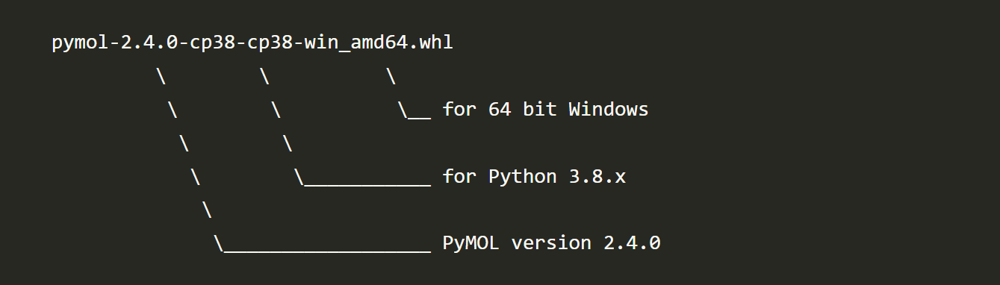

# 0. What is Pymol
Pymol is structural biology tool for viewing and editing protein structure.파이몰은 있자너 단백질 구조를 시각적으로 볼수 있게 해주거던 그냥 설치하면돼. There are similar kinda called Chimera, VMD, PMV... somany of them but Pymol has the most intuitive interface and selection mechanism. 머 잡다한것들 여러개가 있지만 파이몰은 좀 직관적이라 사용하기 편할거야 ...

# 1. Installation Methods
History goes back to 2000. guy name called Warren Lyford DeLano wrote the first code as a open source. Then 2010 Schrödinger, Inc. purchased it. 간단히 말해 슈레딩거가 오픈소스였던 파이몰을 산거야.
So Schrödinger offers 1) Msi file to install on Windows 10 and it is not free. 윈도우 설치파일은 돈내야함 2) Pip install. 핍이 파이썬 패케이지 매니져란걸 다들 알지? 근데 말이야 핍이 처음 나왔을때 파이썬 라이브러리 위주였기때문에 그때는 Numpy같은 C언어로된 넘들을 컴파일 해야하면 잘 안되고 그랬거던... 머 지금은 잘되긴해 하지만 생물정보학 전공자라면 많은 수의 패케이지가 없어... 불편할거야. 3) Conda install. 아나콘다 패케이지 매니져는 굉장히 커서 다양한 생물정보학 툴들을 포함하고있고 콘다 환경안에 pip을 포함 할 수 있기 때문에 더 많은걸 하려면 이걸 권장해. 최대한 콘다로 설치하고 안되는것들은 pip을 이요해 설치한다면 둘이 충돌을 일으키는걸 막을 수 있을꺼야.

# 2. Using Anaconda install Pymol
We will use conda install because we need a lot more for the updated modules. 우리는 있지 콘다를 써서 설치해볼꺼야. 그게 속편하거든 형을 믿어라 ^^ 알쥐.  
https://omicx.cc/posts/2021-04-20-install-pymol-windows/  
위 링크에 보면 설명이 있고 이걸 참고하면되는데 바뀐점은 Anacoda를 사용할 거고 윈도우 터미널을 사용한다는 가정을 할거야.

## 1) Locate the source code
https://github.com/schrodinger/pymol-open-source  
Here is the souce code, however it is mix of C++, Python, Numpy, Tkinter, PyQT. 오픈소스가 다 그러하듯 코드가 역사도 오래되고 개발자가 바뀌면서 일관성이 없어 ... 쓰레기까진아니지만 컴파일이 잘 안될 수도 있거던.....
So here is the binary file  
https://www.lfd.uci.edu/~gohlke/pythonlibs/#pymol-open-source  
Thanks to  Christoph Gohlke of the Laboratory for Fluorescence Dynamics, University of California, Irvine, he has lots of pre-compiled binaries of whl files. 고맙게도 크리스토퍼가 컴파일 다 해놨으니까 님들은 그냥 다운로드만 받으면됨.  

  
파이썬 버젼과 윈도우가 32비트인지 64비트인지 잘 알아보고 다운로드하시길 바람. 다양한 켐비네이션이 존재하지만 파이몰 버젼 2.4와 파이썬 버젼 3.8이 잘 구동되는것을 확인했슴 참고바람. 

## 2) Install Anaconda
Well This is a time sensitive issue. so far at the year of 2022 march. There are Python version 3.10 got released. and official support for Anaconda is 3.9 then should I download conda version 3.8? NO. Just download latest version then we will create downgraded python environment. 아나콘다를 줄여서 콘다라고하는데 좀더 가벼운 최소사향을 미니콘다라고 하는것을 다들 알죠 ^^. 콘다 설치는 콘다 홈피에 가면 너무 쉽게 설명이되어있어서 내 윈도우 활경을 찾아서 설치파일을 안내해줌 꿀.... 전에는 내가 설치한 파이썬 버젼에 맞추어서 파이썬으로 설치해야했슴... 흑 역사 ^^; 단 콘다에서는 파이썬 버젼을 강제하는데 파이썬이 3.10까지 나온 상황이고 최신걸 받으면 파이썬 버젼 3.9일건데 문제는 아직은 불안정하기때문에 그냥 최신 콘다를 다운로드 받고 파이몰을 위한 환경에서 파이썬버젼을 3.8로 다운그레이드 시킬꺼임 ^^  

   
C:\ProgramData\Anaconda3  
에 설치가됨을 알 수 있죠 ^^

